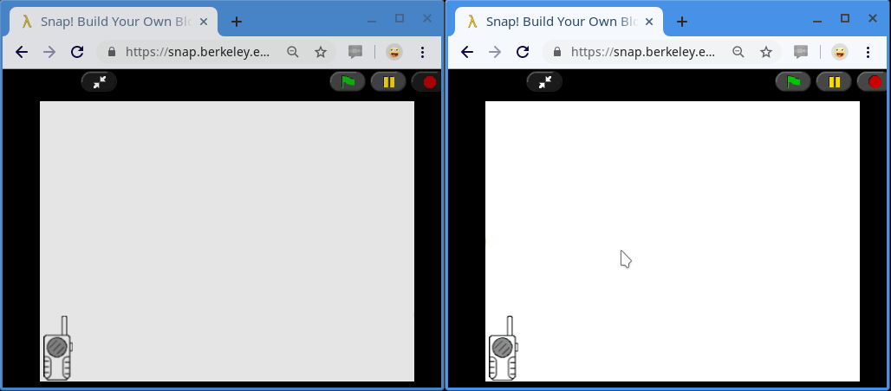

# Shared Snap!

## A Computational Thinking Project

The *Shared Snap!* project wants to combine [Berkeley's Snap!](https://snap.berkeley.edu/) learning tool with a custom RESTful Web Server in order to allow microworlds intercommunication. 

Given the absence of this feature in the *Snap!* environment, we decided to tackle this challenge: we think that introducing communication between microworlds residing in different browser windows (or even in different machines!) could be very fun and engaging, allowing for lots of new possibilities. Already existing *Snap!* official libraries allow to make RESTful requests and to interact with JSON objects, therefore the choice of a RESTful Web Server came up naturally.

The image below shows the *sequence diagram* for the data exchanged between the Client actor (the one who wants to communicate with another actor remotely), the Walkie Talkie actor, and the Web Server.


Course reference: 
- https://www.unibo.it/it/didattica/insegnamenti/insegnamento/2018/430273

Team members:
- marco.canducci@studio.unibo.it  
- daniele.schiavi@studio.unibo.it 

---

## Server side

### What we've done

First of all, we thought of modeling the *connection* as something to do in order to allow the sending and reception of messages to and from other users connected to the same server.

We decided to introduce at least a simple authentication system that assign an unique *Token* to every user at the moment of the connection to the server. That token must be included by the client in every subsequent request inside the *Authorization* header. To send a message, it's mandatory to be connected to the server, providing your authentication token along with the recipient's nickname.

The custom Web Server has been developed using *Kotlin*, *VertX* and *MongoDB*, implementing handlers for a set of previously defined RESTful API which [documentation is available on SwaggerHub](https://app.swaggerhub.com/apis-docs/candoz/shared-snap/1.0#/).


### Server execution requirements

- Java 8 must be installed;

- a MongoDB daemon must be running on `localhost:10000`.

### Server Setup

It is possible to download the source code and the executable jar directly from the [project releases page](https://github.com/candoz/shared-snap/releases).

You can modify the configuration file **`config.yaml`** according to your needs: you can set the `host` and `port` of the server and the MongoDB `connection_string`. By default they are set respectively to: *localhost*, *10000* and *mongodb://localhost:27017/snapdb*.

In order to run the Web Service you must execute the following command:

```
java -jar shared-snap-1.0-all.jar
```

**N.B.** The server has been currently designed to use the *http* protocol while Snap website uses the *https* protocol. Running everything locally arises no problems but, if at least one client resides on a different machine than the server, it will be necessary to take one of the following measures:

- the Web Service must be configured to use the *https* protocol since browsers block *mixed content* by default;

- alternatively, permissions for *mixed content* must be manually enabled for your browser.

---

## Client side

### What we've done

We started the client development by importing two official *Snap!* libraries and modifying them in order to obtain a better error handling capabilities:

- we extended `Web Services Access (HTTPS)` in order to make it possibile to read both the *body* and the *http response code*. This way, our *Walkie Talkie* actor can be able to always know and report back the reason of an eventual request failure;

- we extended `Deal with JSON data` in order to better manage the transformation error that may arise from a JSON formatted string to Snap's list conversion.

From there, we added an abstraction layer through a set of new *Snap!* blocks, useful for the interaction with our custom Web server. Finally, we added an additional abstraction layer with the purpose of hiding technicalities such as the polling and authentication system behind the *Walkie Talkie* actor, allowing the use of the application even by less experienced users.  

### Client execution requirements

- The server must be running;

- it's strongly recommended to use the Chrome browser (or Chromium derivates) to avoid problems with CORS requests.

### Client Setup

To use *Shared Snap!* you need to import first our custom blocks and then the Walkie Talkie actor. It's possible to choose between the following methods:
- clone the repository and import to your Snap project the *shared snap blocks.xml* and *walkie talkie.xml* files placed inside the *client* directory;
- alternatively, just downloads the single files and import them to your Snap project: [custom blocks](https://www.dropbox.com/s/32r0m4b95ky5a7j/shared%20snap%20blocks.xml?dl=0), [walkie talkie actor](https://www.dropbox.com/s/gkei0joeotqdcju/walkie%20talkie.xml?dl=0).

### Interaction API

The *Walkie Talkie* actor offers simple a API for connecting, disconnecting, sending and receiving messages.

- <br />
Connect as <*your nickname*> to the server with the provided address. This block will fail if another user is already connected to the same server with the same nickname.

- <br />
Disconnect your user from the server; as a result your nickname will become available again in that server.


- <br />
Send a message specifying the JSON content and the recepient username.

- <br />
To **receive a remote message** you must use the `when I receive` block with the "*any message*" parameter selected and then filter the message for the *remote message* type.<br />
Note that every time our Walkie Talkie actor receives a message intended for our user (sent to our nickname) it broadcasts a JSON message with the fields `type` set to "*remote message*", `sender` and `content` where the `content` corresponds to the actual JSON object that was sent to us by the `sender`.

```
{
    "type": "remote message",
    "sender": "...",
    "content": { ... }
}
```

- Using the `when I receive` block it's also possible to observe many informational messages that come from the Walkie Talkie as listed in the image below.<br />


---

## Prototype demonstration

To showcase our project functionalities we decided to implement a public demo that shows how a ball can bounce from one microworld to another.



When the ball passes from one world to another the message exchanged between the two contains: the vertical position coordinate, the module and the angle of the velocity vector.

```
{
    "y": ...,
    "velocityModule": ...,
    "velocityAngle": ...
}
```

**To run the demo follow these steps**:

1. start the Web Service on your machine

2. open both the following links:  [left screen](https://snap.berkeley.edu/project?user=schiavi&project=Shared%20Snap%20-%20Ball%20Example%20-%20Left), [right screen](https://snap.berkeley.edu/project?user=schiavi&project=Shared%20Snap%20-%20Ball%20Example%20-%20Right)

3. on the **right** screen:
    - hit the `c` button to connect to the server (the circle inside the walkie talkie will light up from gray to green)

4. on the **left** screen:
    - hit the `c` button to connect to the server (the circle inside the walkie talkie will light up from gray to green)
    - the ball will appear at the center of the screen and will start moving from one browser window to the other.

---

## License

*Shared Snap!* is licensed under the [Affero General Public License](https://www.gnu.org/licenses/agpl-3.0).
